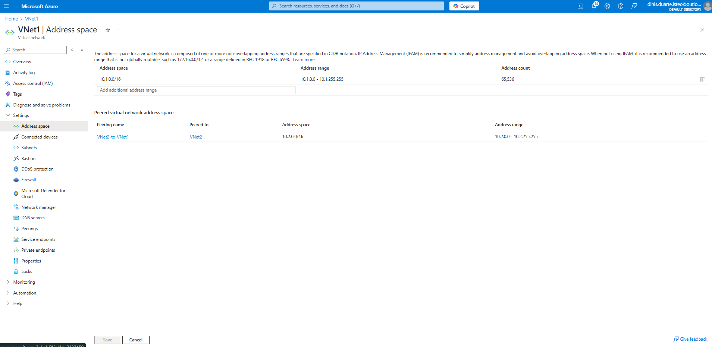
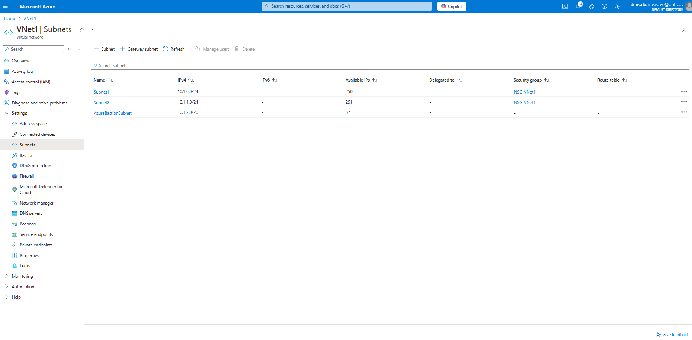
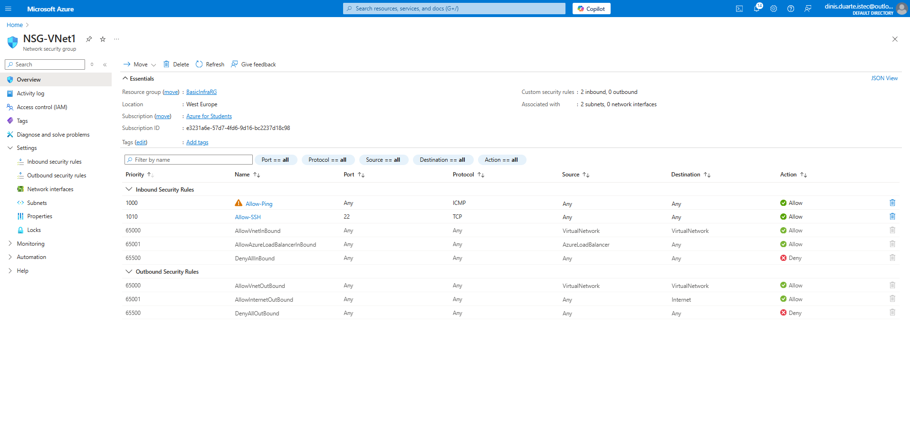
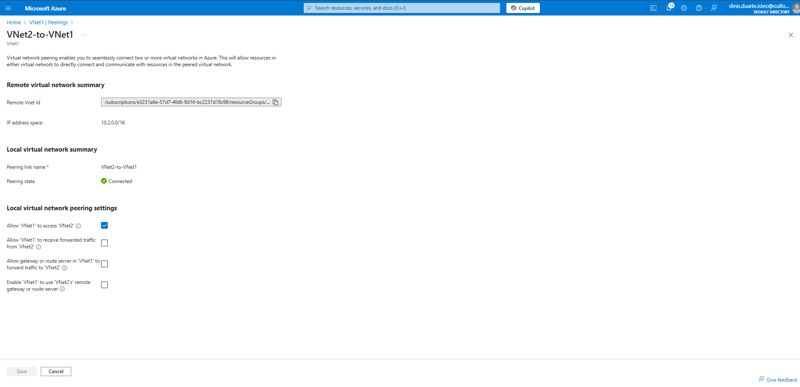
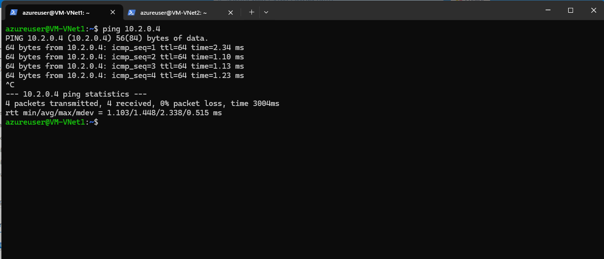
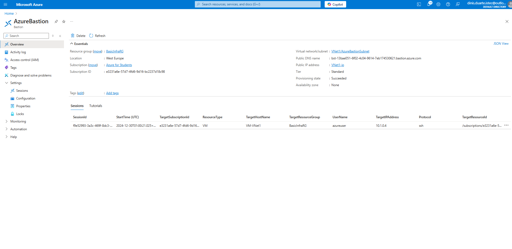
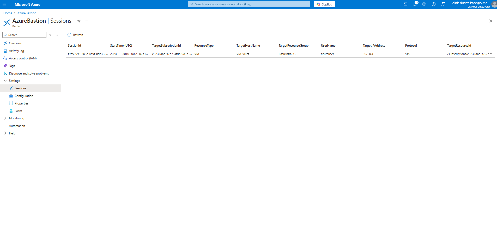
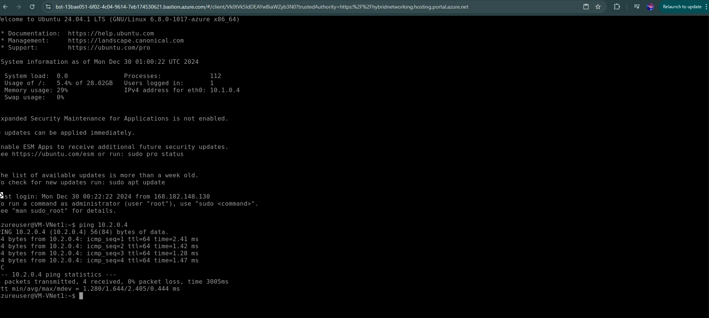
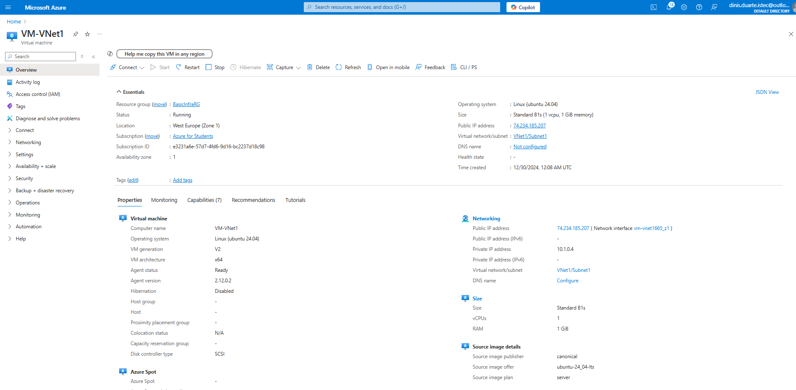
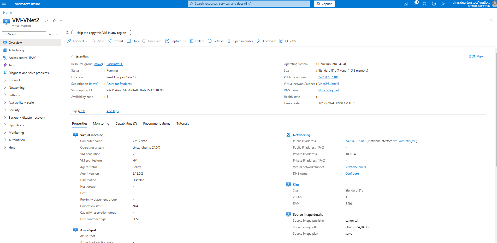

# Azure Networking and Security
**An Azure Lab for Advanced Networking and Security Configurations**
---

This project demonstrates how to set up and secure virtual networks in Azure. It includes creating Virtual Networks (VNets), configuring subnets, Network Security Groups (NSGs), peering two VNets, and testing connectivity using Virtual Machines (VMs). Additionally, it highlights the use of Azure Bastion for secure VM access.

---

## Table of Contents
1. [Project Objectives](#project-objectives)
2. [Steps Implemented](#steps-implemented)
3. [Screenshots](#screenshots)
4. [Example Output for Connectivity Tests](#example-output-for-connectivity-tests)
5. [Useful Links](#useful-links)
6. [License](#license)
7. [Contributions](#contributions)

---

## Project Objectives
  - Set up two Virtual Networks (VNet1 and VNet2) with appropriate subnets.
  - Configure Network Security Groups (NSGs) to control inbound and outbound traffic.  
  - Peer VNet1 and VNet2 to enable cross-network communication.
  - Deploy and test Virtual Machines (VMs) within the VNets.
  - Use Azure Bastion for secure and public IP-independent access to the VMs.


## Steps Implemented

1. **Create Virtual Networks** ([Learn More](https://learn.microsoft.com/en-us/azure/virtual-network/virtual-networks-overview))
  - Set up VNet1 and VNet2 with custom CIDR ranges.
  - Configure subnets, including an AzureBastionSubnet.

  - VNet1:
     - Address space: 10.1.0.0/16
     - Subnet1: 10.1.0.0/24 (Default subnet)
     - AzureBastionSubnet: 10.1.1.0/24
   - VNet2:
     - Address space: 10.2.0.0/16
     - Subnet2: 10.2.0.0/24 (Default subnet)
  
2. **Configure Network Security Groups (NSGs)** ([Learn More](https://learn.microsoft.com/en-us/azure/virtual-network/network-security-groups-overview))
  - Create NSGs for both VNets.
  - Set rules to allow ICMP (Ping) and SSH traffic.

   - NSG-VNet1:
     - Allow SSH (Port 22) inbound from any source.
     - Allow ICMP (Ping) inbound for troubleshooting.
   - NSG-VNet2:
     - Allow SSH (Port 22) inbound from any source.
     - Allow ICMP (Ping) inbound for troubleshooting.
 
3. **Peer Virtual Networks** ([Learn More](https://learn.microsoft.com/en-us/azure/virtual-network/virtual-network-peering-overview))
  - Establish bidirectional communication between VNet1 and VNet2.

   - Peering from VNet1 to VNet2:
     - Enabled Allow Gateway Transit.
   - Peering from VNet2 to VNet1:
     - Enabled Use Remote Gateways.
    
4. **Deploy Virtual Machines** ([Learn More](https://learn.microsoft.com/en-us/azure/virtual-machines/linux/overview))
  - Create Ubuntu VMs in each VNet for connectivity testing.

   - VM1 in VNet1:
     - Private IP: 10.1.0.4
     - NSG: Associated with NSG-VNet1
     - OS: Ubuntu 20.04 LTS
   - VM2 in VNet2:
     - Private IP: 10.2.0.4
     - NSG: Associated with NSG-VNet2
     - OS: Ubuntu 20.04 LTS

5. **Test Connectivity** ([Learn More](https://learn.microsoft.com/en-us/azure/virtual-network/virtual-network-troubleshoot-connectivity))
  - Validate communication between VMs across VNets using ping and ssh.

    - From VM1 in VNet1, ping VM2 in VNet2 using:
     ```bash
     ping 10.2.0.4
     ```
   - From VM2 in VNet2, ping VM1 in VNet1 using:
     ```bash
     ping 10.1.0.4
     ```
    
6. **Deploy Azure Bastion** ([Learn More](https://learn.microsoft.com/en-us/azure/bastion/overview))
  - Configure Azure Bastion for secure VM management without public IPs.

    - Deployment in VNet1:
     - Associated with AzureBastionSubnet.
     - Tested SSH access to VM1 and VM2 without using public IPs.

### Screenshots

1. **Virtual Network Creation**  
   
   *This screenshot shows the configuration of VNet1, including its address space and subnets.*

3. **Subnet Configuration**  
   
   *This screenshot highlights the subnet details for both VNets, including the AzureBastionSubnet.*


5. **NSG Configuration**  
   
   *This screenshot displays the Network Security Group (NSG) rules for managing inbound and outbound traffic.*


6. **VNet Peering Configuration**  
   
   *This screenshot demonstrates the peering setup between VNet1 and VNet2.*


8. **Ping Test Between VMs**  
   
   *This screenshot verifies connectivity between VMs in VNet1 and VNet2 using the ping command.*


10. **Azure Bastion Deployment**  
   
   *This screenshot shows the deployment of Azure Bastion for secure and public IP-independent access to VMs.*


12. **Azure Bastion Connection**  
   - Part 1: 
     *This screenshot captures the Azure Bastion interface during the connection to a VM in VNet1.*  
   - Part 2: 
     *This screenshot captures the Azure Bastion interface during the connection to a VM in VNet2.*


11. **Virtual Machine Overviews**  
   - VM in VNet1: 
     *This screenshot provides an overview of the VM deployed in VNet1, including private IP and OS details.*  

   - VM in VNet2: 
     *This screenshot provides an overview of the VM deployed in VNet2, including private IP and OS details.*


## Technologies Used
  - Azure Virtual Networks (VNets) for network segmentation.
  - Network Security Groups (NSGs) for traffic filtering.
  - Azure Bastion for secure VM management.
  - Ubuntu Linux VMs for testing network connectivity.

---

## Steps to Reproduce

1. Clone this repository:
   git clone https://github.com/dinAlexDu/azure-networking-and-security.git
   cd azure-networking-and-security

2. Follow the Azure Virtual Network Documentation:
   https://learn.microsoft.com/en-us/azure/virtual-network/

3. Configure subnets and NSGs as per the project steps.

4. Test connectivity between VMs and deploy Azure Bastion for secure access.

---

## Example Output for Connectivity Tests

### Ping Test from VM1 (VNet1) to VM2 (VNet2)
Run the following command on **VM1**:
```bash
ping 10.2.0.4
```
Expected Output:
```bash
PING 10.2.0.4 (10.2.0.4) 56(84) bytes of data.
64 bytes from 10.2.0.4: icmp_seq=1 ttl=64 time=0.525 ms
64 bytes from 10.2.0.4: icmp_seq=2 ttl=64 time=0.492 ms
64 bytes from 10.2.0.4: icmp_seq=3 ttl=64 time=0.487 ms
64 bytes from 10.2.0.4: icmp_seq=4 ttl=64 time=0.489 ms
--- 10.2.0.4 ping statistics ---
4 packets transmitted, 4 received, 0% packet loss, time 3004ms
rtt min/avg/max/mdev = 0.487/0.498/0.525/0.015 ms
```
### Ping Test from VM2 (VNet2) to VM1 (VNet1)
Run the following command on **VM2**:
```bash
ping 10.1.0.4
```
Expected Output:
```bash
PING 10.1.0.4 (10.1.0.4) 56(84) bytes of data.
64 bytes from 10.1.0.4: icmp_seq=1 ttl=64 time=0.525 ms
64 bytes from 10.1.0.4: icmp_seq=2 ttl=64 time=0.492 ms
64 bytes from 10.1.0.4: icmp_seq=3 ttl=64 time=0.487 ms
64 bytes from 10.1.0.4: icmp_seq=4 ttl=64 time=0.489 ms
--- 10.1.0.4 ping statistics ---
4 packets transmitted, 4 received, 0% packet loss, time 3004ms
rtt min/avg/max/mdev = 0.487/0.498/0.525/0.015 ms
```

### Testing Secure Connectivity with Azure Bastion
Run the following command in the Bastion console to connect to VM1:
```bash
ssh azureadmin@10.1.0.4
```
Expected Output:

```bash
The authenticity of host '10.1.0.4 (10.1.0.4)' can't be established.
ECDSA key fingerprint is SHA256:xyzxyzxyz.
Are you sure you want to continue connecting (yes/no)? yes
Warning: Permanently added '10.1.0.4' (ECDSA) to the list of known hosts.
azureadmin@VM1:~$
```

Run the following command in the Bastion console to connect to VM2:
```bash
ssh azureadmin@10.2.0.4
```
Expected Output:
```bash
The authenticity of host '10.2.0.4 (10.2.0.4)' can't be established.
ECDSA key fingerprint is SHA256:xyzxyzxyz.
Are you sure you want to continue connecting (yes/no)? yes
Warning: Permanently added '10.2.0.4' (ECDSA) to the list of known hosts.
azureadmin@VM2:~$
```


## Useful Links

- [Azure Virtual Network Documentation](https://learn.microsoft.com/en-us/azure/virtual-network/): Official documentation for Azure VNets, covering creation and configuration.
- [Azure Bastion Documentation](https://learn.microsoft.com/en-us/azure/bastion/): Learn how to securely access your VMs using Azure Bastion.
- [Network Security Groups Documentation](https://learn.microsoft.com/en-us/azure/virtual-network/network-security-groups-overview): Understand how to configure NSGs for traffic filtering.
- [SSH Basics](https://www.ssh.com/academy/ssh): A beginner's guide to SSH for secure remote access.
- [Azure Bastion Quickstart](https://learn.microsoft.com/en-us/azure/bastion/tutorial-create-host-portal): A quickstart guide for deploying and using Azure Bastion.


---

## License
This project is licensed under the MIT License. See the [LICENSE](./LICENSE) file for details.

## Contributions
Contributions are welcome! Please fork this repository and submit a pull request with your improvements.  
Please adhere to our [Code of Conduct](./CODE_OF_CONDUCT.md) when contributing to this project.


